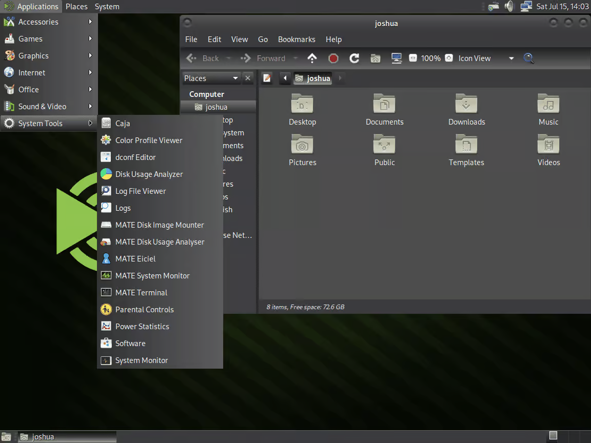
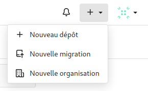

# Configuration matérielle dans Virtual Box  

- Que signifie “64-bit” dans “Debian 64-bit” ?
 
>Le 64 bits dans "Debian 64-bit" indique que c'est la version 64 bits de Debian.  
> Un OS en 64 bits nécessite un processeur en 64 bits également, cela permet à l'OS d'être plus performant, de pouvoir gérer plus de données et d'avoir un seuil maximal de mémoire RAM beaucoup plus élevé.

 - Quelle est la configuration réseau utilisée par défaut ?

>La configuration réseau utilisée par défaut est **NAT**[^NAT].

 - Quel est le nom du fichier _XML_ contenant la configuration de votre machine ?

>Le fichier XML contenant la configuration de la machine se nomme **sae203.xml**.

- Sauriez-vous le modifier directement ce fichier de configuration pour mettre 2 processeurs à votre machine ?

>Ce fichier n'est pas modifiable directement, il faut passer par VBox afin de modifier la configuration de celui-ci.

[^NAT]: NAT signifie *Network Adress Translation* ou translation d'adresse réseau en Français.  

# Installation OS de base

- Qu’est-ce qu’un fichier ISO bootable ?

>Un fichier ISO bootable est une image d'un CD qui peut être exécuté. 
>Dans notre cas, on l'exécute au démarrage de la machine afin d'installer l'OS.

- Qu’est-ce que _MATE_ ? _GNOME_ ?

>MATE et GNOME sont des environnements de bureau, qui permettent de modifier l'interface graphique de l'OS.

{width=60% height=60%}

- Qu’est-ce qu’un serveur _web_ ?

>Un serveur WEB est une machine connectée à Internet qui stocke différents fichiers.
>Celui-ci les transmet aux machines qui les demandent lorsqu'ils se connectent au serveur.

- Qu’est-ce qu’un serveur _ssh_ ?
		
>SSH[^SSH] est un protocole réseau qui permet aux administrateurs d'accéder à distance à un ordinateur, en toute sécurité.

- Qu’est-ce qu’un serveur _mandataire_ ? 

>Un serveur mandataire, ou *proxy* est un serveur informatique qui a pour fonction de relayer des requêtes entre un poste client et un serveur.

[^SSH]: SSH signifie Secure Socket Shell ou carapace sécurisée en Français.  

# Sudo

- Comment peux-ton savoir à quels groupes appartient l’utilisateur _user_ ?

>Pour connaitre les groupes d'un utilisateur courant, on peut utiliser la commande **`groups`**.
		La commande **`groups \<user>`** permet de connaitre les groupes d'un utilisateur en particulier.

- Comment donner les droits sudo à un utilisateur ?

>Pour donner les droits sudo à un utilisateur nommé toto, on utilise la commande **`usermod -aG sudo toto`** depuis l'utilisateur root.

# Suppléments invités

- Quel est la version du noyau _Linux_ utilisé par votre VM ? N’oubliez pas, comme pour toutes les questions, de justifier votre réponse.

>Pour connaitre la version du noyau Linux utilisé, on peut utiliser la commande **`uname -r`**, qui dans notre cas affiche **6.1.0-17-amd64**.

- À quoi servent les suppléments invités ? Donner 2 principales raisons de les installer.

> Les suppléments invités permettent d'ajouter de nouvelles fonctionnalités pour la VM, tel que l'ajustement automatique de la résolution d'écran, le glisser-déposer ou encore les dossiers partagés.

- À quoi sert la commande `mount` (dans notre cas de figure et dans le cas général) ?

> La commande `mount` permet de demander au système de rendre un système de fichiers accessible, à un emplacement spécifié.

# Quelques Questions

- Qu’est-ce que le Projet Debian ? D’où vient le nom _Debian_ ?

> D'après la [FAQ du site de Debian](https://www.debian.org/doc/manuals/debian-faq/basic-defs.en.html#pronunciation), le projet vise à créer un système d'exploitation, compatible Unix, libre et de grande qualité complété d'un ensemble d'applications.
> Le nom Debian est la contraction des noms Debra et Ian Murdock qui a fondé le projet.  

{width=15% height=15%}

## - La maintenance

- Il existe 3 durées de prise en charge (support) de ces versions : la durée minimale, la durée en support long terme (LTS) et la durée en support long terme étendue (ELTS). 
Quelle sont les durées de ces prises en charge ?

> D'après le site de [Debian](https://www.debian.org/releases/index.fr.html) et le [Wiki Debian](https://wiki.debian.org/LTS/Extended), La durée minimale de support des versions Debian est de 3 ans, 5 ans pour le LTS et 10 ans pour le ELTS

- Pendant combien de temps les mises à jour de sécurité seront-elles fournies ?

> D'après la [FAQ](https://www.debian.org/security/faq#lifespan) du site officiel Debian, l'équipe en charge de la sécurité publie des mises à jour de sécurité sur la version stable pendant 3 ans après sa publication.

## - Nom générique, nom de code et version

- Combien de version au minimum sont activement maintenues par Debian ? Donnez leur nom générique (= les types de distribution).

> Debian annonce sur son [site](https://www.debian.org/releases/index.fr.html) avoir toujours au moins 3 versions activement maintenues, la version _"stable"_, _"testing"_ et _"unstable"_.

- Chaque distribution majeure possède un nom de code différent. 
Par exemple, la version majeure actuelle (Debian 12) se nomme Bookworm. 
D’où viennent les noms de code donnés aux distributions ?

> Le [Wiki Debian](https://wiki.debian.org/fr/DebianReleases) indique que les noms de code donnés aux distributions proviennent des personnages provenant des films Toy Story.

- L’un des atouts de Debian fut le nombre d’architectures officiellement prises en charge. 
Combien et lesquelles sont prises en charge par la version Bullseye ?  

> D'après le [Wiki Debian](https://wiki.debian.org/DebianBullseye?highlight=%28CategoryRelease%29#Architectures), 9 architectures sont prises en charge par Debian Bullseye.

- Première version avec un nom de code  

	> Toutes les réponses des deux prochaines parties sont issues du [Wiki Debian](https://wiki.debian.org/DebianReleases)

	1. Quel a été le premier nom de code utilisé ?

		> Le premier nom de code à avoir été utilisé est Buzz
		
	2. Quand a-t-il été annoncé ?

		> Elle a été publiée le 17 juin 1996.
		
	3. Quel été le numéro de version de cette distribution ?

		> Il s'agit de la version 1.1 de Debian.

- Dernier nom de code attribué

	1. Quel est le dernier nom de code annoncé à ce jour ?  
	
		> Le dernier nom de code annoncé est Forky.
	
	2. Quand a-t-il été annoncé ?
	
		> Ce dernier a été annoncé le 13 octobre 2022.
		
	3. Quelle est la version de cette distribution ?
	
		> Il s'agit de la version 14 de Debian.

	{width=40% height=40%}

# Automatisation

## Ajustements de la pré-configuration

- Ajouter le droit d’utiliser sudo à l’utilisateur standard
- Installer l’environnement MATE.
- Ajouter les paquets suivants :
	- sudo : sinon la gestion sudo est inutile
	- git, sqlite3, curl : pour préparer l’installation de la semaine prochaine
	- bash-completion : va vous simplifier grandement l’écriture des lignes de commande
	- neofetch : pas très utile, mais c’est un classique dans son genre (essayez-le)

> Afin de modifier la pré-configuration de la machine, il faut modifier le fichier *preseed-fr.cfg* dans le dossier autoinstall de notre machine  

> - Pour donner les droits sudo à l'utilisateur, on modifie la ligne concernant les groupes par défaut, on obtient ceci :  
`d-i passwd/user-default-groups string audio cdrom video`**  
>
>
> - Pour installer l'environnement MATE, on modifie mes lignes concernant les métapaquetages, ce qui donne la ligne suivante  
**`tasksel tasksel/first multiselect standard ssh-server mate-desktop`**
> - Pour ajouter les paquets demandés, on ajoute, à la suite de la ligne précédente, cette commande :  
**`d-i pkgsel/include sudo git sqlite3 curl bash-completion neofetch`**  
>
> 	Ce qui nous donne ceci :  
>

# Git

## Les interfaces graphiques pour Git

- Qu’est-ce que le logiciel _gitk_ ? Comment se lance-t-il ?

	>Gitk est un logiciel graphique permettant de visualiser l'historique d'un projet Git, les différentes branches, commits ainsi que toutes les informations associées. Il peut se lancer via un terminal via la commande `gitk` dans un terminal ou via l'interface de Git GUI.

- Qu’est-ce que le logiciel _git-gui_ ? Comment se lance-t-il ?

	>Git GUI est une interface graphique de Git qui permet aux utilisateurs de réaliser de nouveaux commits, supprimer des commits existants, créer de nouvelles branches, fusionner les branches existantes ou push les changements vers un répertoire distant.  
	>Contrairement à GitK, Git GUI n'affiche pas l'historique du projet et se concentre sur les commits.  
    >On peut le démarrer via la commande `git gui` dans un terminal.

## Installons autre chose et comparons

- Pourquoi avez-vous choisi ce logiciel ?

	> Nous avons choisi d'installer **GitKraken**, car c'est un logiciel polyvalent et populaire qui permet la visualisation de l'historique ainsi que la gestion des commits tout en proposant une interface épurée et ergonomique.  
    Tout cela via un client gratuit, ainsi qu'un client payant proposant plus de fonctionnalités.  

	{width=40% height=40%}

- Comment l’avez-vous installé ?

	>Sur Debian, on peut installer Git Kraken via les commandes :  
        **`wget https://release.gitkraken.com/linux/gitkraken-amd64.deb`  
        `sudo apt install gitkraken-amd64.deb`**
		
- Comparez-le aux outils inclus avec git (et installé précédemment) ainsi qu’avec ce qui serait fait en ligne de commande pure : fonctionnalités avantages, inconvénients...  

| Caractéristique                | Gitk                                | GitKraken                            | Git GUI                                     |
|:------------------------------:|:-----------------------------------:|:------------------------------------:|:-------------------------------------------:|
| Interface utilisateur | Interface graphique simple et minimale       | Interface graphique moderne et intuitive | Interface graphique simple et fonctionnelle |
| Support des fonctionnalités Git | Affiche l'historique des commits et des branches | Gestion complète des dépôts Git, avec visualisation graphique | Offre des fonctionnalités de base pour gérer les dépôts Git |
| Intégration des graphes | Graphique des commits et des branches         | Graphiques visuels pour l'historique des commits et les branches | Affiche les commits et les branches sous forme de graphiques |
| Fonctionnalités supplémentaires | Fonctionnalités limitées, principalement pour visualiser l'historique | Intégration avec GitHub, Bitbucket et GitLab, gestion des conflits, fonctionnalités de collaboration | Intégration avec des outils externes, comme des clients de merge |
| Personnalisation | Limitée                                        | Personnalisation avancée de l'interface | Possibilité de personnaliser l'apparence et le comportement |  
  
  

# Gitea  

## À propos  

- Qu'est-ce que Gitea ?

	>Gitea est une plateforme de gestion de code source et de collaboration.
	 C'est une solution open-source qui permet aux équipes de développeurs de travailler ensemble sur des projets de logiciels en utilisant Git pour le contrôle de version.  
	 Gitea offre des fonctionnalités telles que le suivi des problèmes, la gestion des demandes de fusion, la gestion des autorisations d'accès.

- À quels logiciels bien connus dans ce domaine peut-on le comparer ?

	>Gitea peut être comparé à GitHub ou encore GitLab qui proposent des fonctionnalités similaires.
	Cependant, Gitea est reconnu pour être facile d'utilisation.

## Installation    

Nous installerons ici la dernière version de Gitea, la version 1.21.7
Afin d'installer Gitea depuis les binaires[^GiteaInstall], comme demandé dans le sujet, nous devons utiliser la commande :  
	
	wget -O gitea https://dl.gitea.com/gitea/1.21.7/gitea-1.21.7-linux-amd64`  

Puis afin de rendre exécutable Gitea, on utilise : 

	chmod +x gitea

[^GiteaInstall]: Il est en effet possible d'installer Gitea de plusieurs manières différentes, depuis les fichiers binaires, comme ici, avec l'aide d'un gestionnaire de paquet, ou bien depuis le code source.   

## Contrôle de la signature GPG  

Si le fichier binaire est téléchargé manuellement, on peut vérifier que le fichier n'a pas été modifié par d'autres personnes que Gitea, car ceux-ci signent les fichiers à l'aide d'une clé GPG.
Une fois le fichier binaire téléchargé, on télécharge le fichier .asc correspondant à la version choisie, puis on a saisi les commandes :

`gpg --keyserver keys.openpgp.org --recv 7C9E68152594688862D62AF62D9AE806EC1592E2` 

Puis :  
`gpg --verify gitea-1.21.7-linux-amd64 gitea-1.21.7-linux-amd64`

Si le message obtenu contient la mention `Good signature from "Teabot <teabot@gitea.io>"` alors le fichier n'a subi aucune modification, sinon le message contiendra la mention `This key is not certified with a trusted signature!`.
Ce qui signifie que le fichier a été modifié et qu'il peut donc ne pas être fiable.

## Configuration serveur  

Afin de pouvoir être exécuté, Gitea nécessite d'avoir Git d'installé sur la machine avec une version supérieure ou égale à la 2.0.

### Création utilisateur  

Il faut créer un utilisateur afin de pouvoir utiliser Gitea, afin d'en créer un on utilise les commandes :  

	adduser \  
		--system \
		--shell /bin/bash \
		--gecos 'Git VErsion Control' \
		--group \
		--disabled-password \
		--home /home/git \
		git 

### Création de la structure de répertoire requise  

Gitea requiert une structure de répertoire particulière afin de pouvoir fonctionner, celle-ci ne se générant pas automatiquement lors de l'installation.
Il faut alors la créer manuellement grâce aux commandes suivantes :  

	mkdir -p /var/lib/gitea/{custom,data,log}  
	chown -R git:git /var/lib/gitea/   
	chmod -R 750 /var/lib/gitea/   
	mkdir /etc/gitea    
	chown root:git /etc/gitea   
	chmod 770 /etc/gitea  

Le répertoire `/etc/gitea` est temporairement créé avec les droits d'écriture pour l'utilisateur git afin que le web installer puisse écrire le fichier de configuration.
Il est recommandé d'enlever ces droits une fois l'installation finie, cela peut être réalisé grâce aux commandes suivantes :  

	chmod 750 /etc/gitea
	chmod 640 /etc/gitea/app.ini

### Configurer le répertoire de travail de Gitea  

Il est nécessaire de définir le répertoire de travail à utiliser par Gitea, afin que celui-ci soit utilisé systématiquement.  
On utilise la commande suivante afin de le définir.  

	export GITEA_WORK_DIR=/var/lib/gitea/

### Ajout de l'autocomplétion bash/zsh  

Afin d'activer l'autocomplétion de bash ou de zsh, il est nécessaire de télécharger le script correspondant et de le copier dans le répertoire `/usr/share/bash-completion/completions/gitea` pour bash ou `/usr/share/zsh/_gitea` pour zsh.

## Mise à jour du service binaire Gitea  

- Quelle version du binaire avez-vous installé ? Donnez la version et la commande permettant d'obtenir cette information ?  

	>Lors de notre installation, nous avons choisi la version 1.21.7 de Gitea.  
	Afin de connaître la version installée, on peut utiliser la commande `gitea -v`

- Comment faire pour mettre à jour le binaire de votre service sans devoir tout reconfigurer ? Essayez en mettant à jour vers la version *1.22-dev*.  

	>Pour mettre à jour le binaire de notre service, il suffit de remplacer le fichier binaire dans `/usr/local/bin/gitea` par le fichier binaire de la nouvelle version.  
	Il suffit ensuite de redémarrer Gitea.
	Afin de passer à la version 1.22-dev, on remplace donc le fichier actuel par le fichier 

## Tests d'utilisation

### Création d'un dépôt  

Gitea étant basé sur Git, il est possible de créer un dépôt afin d'y stocker les fichiers issus d'un même projet.
Pour ce faire, il suffit de cliquer sur le logo correspondant dans le coin supérieur gauche de l'interface Gitea comme sur la figure ci-dessous.  

### Configuration d'un nouveau dépôt  

Suite à la création d'un nouveau dépôt, il sera nécessaire de configurer ce dernier, choisir son nom, sa visibilité...

### Ajouter des fichiers à un dépôt

Vous pouvez ajouter des fichiers à un dépôt en cliquant sur le bouton "**Ajouter des fichiers**" puis en sélectionnant ou en glissant les fichiers que vous souhaitez ajouter.   
  
   